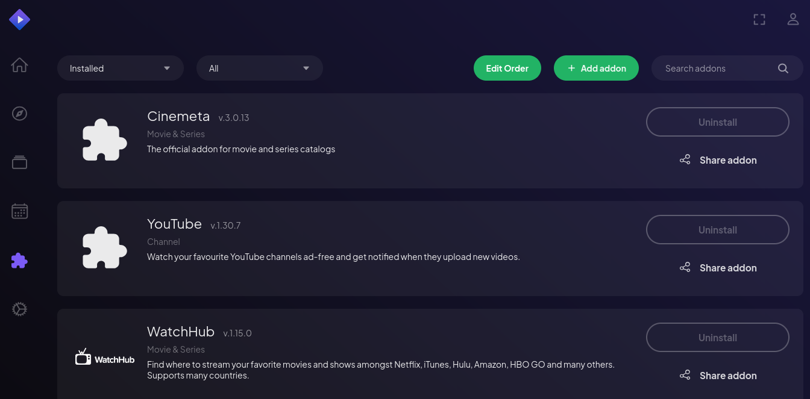
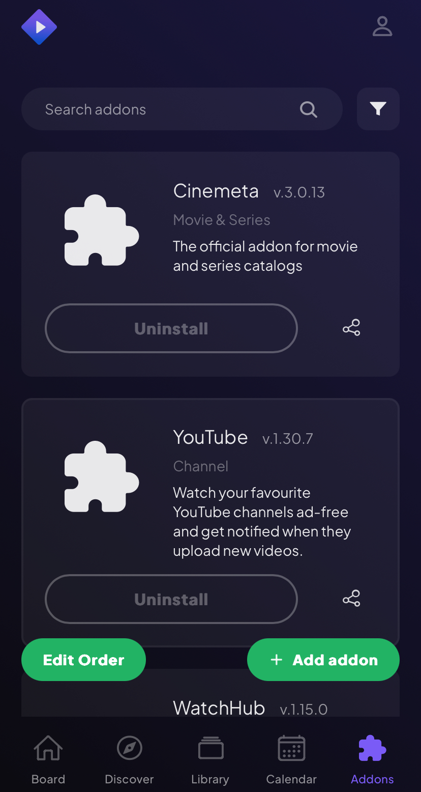

# Stremio Open Addon Manager
Adds a button to your addons page that copies your auth key and opens the community Stremio addon manager site.

## How to Install
Firefox & Chrom Extensions - Comming Soon
[UserScript](https://github.com/MattRangel/stremio-open-addon-manager/releases)

## Previews

